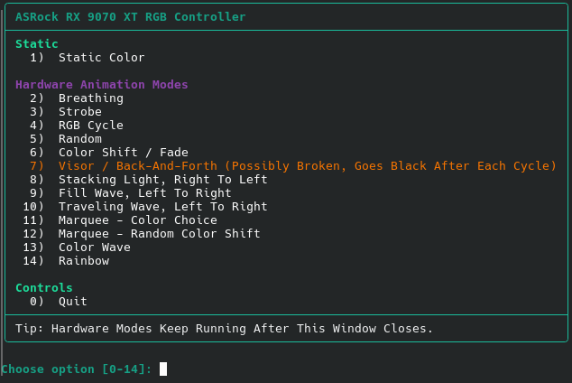

# ASRock RX 9070 XT RGB Controller



A small Linux RGB control tool for the **ASRock RX 9070 XT Steel Legend** GPU.

It provides:

- `gpu-rgb` — an interactive terminal menu
- `asrock-gpu-rgb-apply` — the lower-level command used by the menu

The tool talks directly to the GPU RGB controller over I2C.

> [!WARNING]
> This tool has only been tested on the **ASRock RX 9070 XT Steel Legend**.
> Do not use it on another GPU unless you know the correct I2C bus, address, channel numbers, and mode values.
>
> During testing, mode values `0x10` and higher could freeze the RGB controller until a cold power cycle.
> This tool does **not** use those values.

## Current Status

Version: **0.1.2**

Tested on:

| Item | Value |
|---|---|
| GPU | ASRock RX 9070 XT Steel Legend |
| OS | CachyOS / Arch Linux |
| RGB controller I2C bus | `7` |
| RGB controller I2C address | `0x36` |

This is an early release based on one tested card.

## What Gets Installed

The installer copies two commands into `~/.local/bin`:

| Command | Purpose |
|---|---|
| `gpu-rgb` | Opens the interactive RGB menu. |
| `asrock-gpu-rgb-apply` | Low-level RGB writer used by the menu. |

The installer can also create a desktop launcher named **GPU RGB** at:

```text
~/.local/share/applications/gpu-rgb.desktop
```

## Quick Install: Git Clone

This is the recommended install method.

These commands assume you are using CachyOS, Arch Linux, or another Arch-based distro.

### 1. Install the required packages

```bash
sudo pacman -S git i2c-tools
```

### 2. Download the project from GitHub

This clones the project into a folder in your home directory, then enters that folder.

```bash
cd ~
git clone https://github.com/VirulentArc/asrock-rx9070xt-rgb.git
cd ~/asrock-rx9070xt-rgb
```

### 3. Load the I2C device module

```bash
sudo modprobe i2c-dev
```

### 4. Allow your user to access I2C devices

```bash
sudo groupadd -f i2c
sudo usermod -aG i2c "$USER"
echo 'KERNEL=="i2c-[0-9]*", GROUP="i2c", MODE="0660"' | sudo tee /etc/udev/rules.d/99-i2c.rules
sudo udevadm control --reload-rules
sudo udevadm trigger
```

Now **log out and log back in**.

After logging back in, check that your user is in the `i2c` group:

```bash
groups
```

You should see `i2c` somewhere in the output.

### 5. Run the installer

After logging back in, open a terminal and go back into the project folder you cloned in step 2:

```bash
cd ~/asrock-rx9070xt-rgb
bash ./install.sh
```

Using `bash ./install.sh` tells Bash to run the installer from the current folder. This works even if the file is not marked executable yet.

### 6. Make sure `~/.local/bin` is in your PATH

If you use fish:

```fish
fish_add_path ~/.local/bin
```

If you use bash or zsh:

```bash
echo 'export PATH="$HOME/.local/bin:$PATH"' >> ~/.profile
source ~/.profile
```

### 7. Run the menu

```bash
gpu-rgb
```


## Updating From Git

If you installed with the Git clone method, update from the project folder and run the installer again:

```bash
cd ~/asrock-rx9070xt-rgb
git pull --ff-only
bash ./install.sh
```

Then run the menu again:

```bash
gpu-rgb
```

If `git pull --ff-only` stops with a message about local changes, the update did **not** happen. Check what changed:

```bash
cd ~/asrock-rx9070xt-rgb
git status --short
```

If the listed files are not changes you intentionally want to keep, restore those files, pull again, and reinstall. For example:

```bash
cd ~/asrock-rx9070xt-rgb
git restore bin/asrock-gpu-rgb-apply desktop/gpu-rgb.desktop
git pull --ff-only
bash ./install.sh
```

Do not run `bash ./install.sh` after a failed pull and assume the update was installed. If the pull failed, the installer only reinstalls the version already on your system.

## Other Linux Distros

Install `git` and `i2c-tools` using your distro package manager.

Debian / Ubuntu:

```bash
sudo apt install git i2c-tools
```

Fedora:

```bash
sudo dnf install git i2c-tools
```

openSUSE:

```bash
sudo zypper install git i2c-tools
```

Then follow the same setup steps from the **Quick Install: Git Clone** section, starting at **Download the project from GitHub**.

## If `gpu-rgb` Says “Command Not Found”

The installer places the commands in:

```text
~/.local/bin
```

If your shell does not look there automatically, add it to your PATH.

Fish:

```fish
fish_add_path ~/.local/bin
```

Bash / zsh:

```bash
echo 'export PATH="$HOME/.local/bin:$PATH"' >> ~/.profile
source ~/.profile
```

Then try again:

```bash
gpu-rgb
```

## Usage

Open the menu:

```bash
gpu-rgb
```

Show help:

```bash
gpu-rgb --help
asrock-gpu-rgb-apply --help
```

Show the installed version:

```bash
gpu-rgb --version
```

Set a static color directly without opening the menu:

```bash
asrock-gpu-rgb-apply '#00A0FF'
```

Turn the lighting off:

```bash
asrock-gpu-rgb-apply off
```

## Menu Modes

These are the modes currently exposed by the menu.

| Menu Number | Mode Value | Menu Name | Color Choice | Notes |
|---:|---:|---|---|---|
| `1` | `0x01` + RGB off/black | Off Mode | No | Turns selected zones off. |
| `2` | `0x01` | Static | Yes | Static color. |
| `3` | `0x02` | Breathing | Yes | Confirmed working. |
| `4` | `0x03` | Strobe | Yes | ASRock-style strobe/blinking effect. |
| `5` | `0x04` | Cycling | No | Uses a custom speed table because the normal slowest speed can skip red. |
| `6` | `0x05` | Random | No | Random color changing effect. |
| — | `0x06` | Not used | No | Likely software-driven music mode; not exposed in the menu. |
| `7` | `0x07` | Wave | No | Hardware animation. |
| `8` | `0x08` | Spring | Yes | Hardware animation. |
| `9` | `0x09` | Stack | Yes | Hardware animation. |
| `10` | `0x0A` | Cram | Yes | Hardware animation. |
| `11` | `0x0B` | Scan | Yes | Hardware animation. |
| `12` | `0x0C` | Neon | Yes | Hardware animation. |
| `13` | `0x0D` | Water | No | Hardware animation. |
| `14` | `0x0F` | Rainbow | No | Hardware animation. |
| `15` | `0x0E` | Rainbow 2 | No | Hardware animation. |

## Zone Choices

| Menu Choice | Channels Used |
|---|---|
| All Zones, Including GPU ARGB Header | `3 6 7` |
| GPU Body Only, Top + Fan | `6 7` |
| Top Side Only | `6` |
| Fan Only | `7` |
| ARGB Header Only | `3` |

Known channels on the tested card:

| Channel | Meaning |
|---:|---|
| `3` | GPU ARGB header |
| `6` | Top side / logo lighting |
| `7` | Fan lighting |

## Desktop Launcher

The installer creates a launcher named **GPU RGB**.

It tries to use one of these terminal emulators, in this order:

1. `alacritty`
2. `konsole`
3. `kitty`
4. `gnome-terminal`

Choose the terminal manually during install:

```bash
TERMINAL_CMD="alacritty -e" bash ./install.sh
```

Skip the desktop launcher:

```bash
INSTALL_DESKTOP=0 bash ./install.sh
```

## Advanced: Environment Overrides

Most users do not need this section.

The low-level writer accepts these environment variables:

```bash
GPU_RGB_BUS=7
GPU_RGB_ADDR=0x36
GPU_RGB_CHANNELS='3 6 7'
GPU_RGB_MODE=0x01
GPU_RGB_PARAM_A=0x80
GPU_RGB_PARAM_B=0xFF
GPU_RGB_PARAM_C=0x00
GPU_RGB_WRITE_DELAY=0
```

The menu also accepts:

```bash
GPU_RGB_APPLY=/path/to/asrock-gpu-rgb-apply
GPU_RGB_ALL_CHANNELS='3 6 7'
GPU_RGB_BODY_CHANNELS='6 7'
GPU_RGB_TOP_CHANNEL=6
GPU_RGB_FAN_CHANNEL=7
GPU_RGB_HEADER_CHANNEL=3
GPU_RGB_SKIP_WARNING=1
```

Legacy variable names are still accepted by the low-level writer:

```bash
BUS=7
ADDR=0x36
CHANNELS='3 6 7'
MODE=0x01
BRIGHTNESS=0x80
SPEED=0xFF
DIRECTION=0x00
```

## Advanced: Packet Format

The low-level script sends one 12-byte write per channel:

```text
0x10 0x00 CHANNEL MODE R G B PARAM_A PARAM_B PARAM_C 0x1A 0x00
```

By default, multi-zone writes are sent with no intentional delay between channels. This keeps hardware animation modes visually synchronized across zones. For troubleshooting, the old delayed behavior can be restored with `GPU_RGB_WRITE_DELAY=0.05`.

On the tested controller:

- `PARAM_A` behaves like animation speed.
- `PARAM_B` behaves like brightness.
- `PARAM_C` is usually `0x00` for static and `0x01` for animation modes.

Observed speed values:

| Speed | Value |
|---|---:|
| Slowest | `0xFF` |
| Slow | `0xC0` |
| Medium | `0x80` |
| Fast | `0x40` |
| Fastest | `0x20` |

Cycling uses a custom slowest value of `0xE0` because `0xFF` could skip red.

Observed brightness values:

| Brightness | Value |
|---|---:|
| Dimmest | `0x20` |
| Dim | `0x40` |
| Medium | `0x80` |
| Bright | `0xC0` |
| Brightest | `0xFF` |

## Uninstall

From the repository folder, run:

```bash
bash ./uninstall.sh
```

This removes the installed scripts and desktop launcher.

## Notes

- Hardware animation modes keep running after the menu closes.
- Multi-zone writes use no intentional inter-channel delay so hardware effects start in sync.
- The RGB state may persist across reboot.
- Music mode is not implemented because it is likely software-driven.
- This project is not affiliated with ASRock.

## License

MIT License. See [`LICENSE`](LICENSE).
